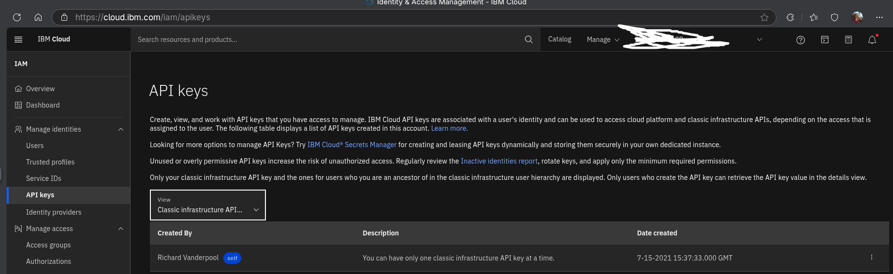

# Overview

Tags resources in IBM Cloud by adhering to the chosen [policy](https://github.com/redhat-performance/cloud-governance/blob/main/POLICIES.md). See secret.yaml and config.yaml to configure account access secrets and configuration. See https://github.com/redhat-performance/cloud-governance/blob/main/README.md for more details on the capabilities of the 
cloud-governance image.

## Running as a cron job

1. Modify `cron.yaml` to deploy to the namespace and job name you desire.
2. Modify `secret.yaml` to define the access credentials and account.
3. Modify `config.yaml` to define configuration.
4. Apply manifests to the desired Kubernetes or OpenShift cluster.

## Running as a Shell Script

```sh
export IBM_CLOUD_API_KEY="IBM Cloud API Key"
export IBM_ACCOUNT_ID="32 character hexadecimal account ID"
export ACCOUNT_NAME="account name"
export IBM_API_KEY="IBM Classic Key"
export IBM_API_USERNAME="IBM Classic User Name"
export TAGS="cost-center:xyz, service-phase:some-phase, app-code:some-app"
podman run --rm --name cloud-governance \
-e PUBLIC_CLOUD_NAME="IBM" \
-e policy="tag_resources" \
-e account="${ACCOUNT_NAME}" \
-e IBM_CLOUD_API_KEY="${IBM_CLOUD_API_KEY}" \
-e IBM_CUSTOM_TAGS_LIST="${TAGS}" \
-e IBM_ACCOUNT_ID="${IBM_ACCOUNT_ID}" \
-e IBM_API_USERNAME="${IBM_API_USERNAME}" \
-e IBM_API_KEY="${IBM_API_KEY}" \
quay.io/cloud-governance/cloud-governance:latest
```
To access the account name and number. Log in to IBM Cloud and click "Manage -> Account"


To access credentials. Click "Manage -> Access (IAM)".

To create an IBM Cloud API Key:


To create an IBM Cloud Classic Infrastructure Key:


The IBM Cloud user name is a combination of the short account number and your email address.  For example:

```
228abcd_myemail@company.com
```
